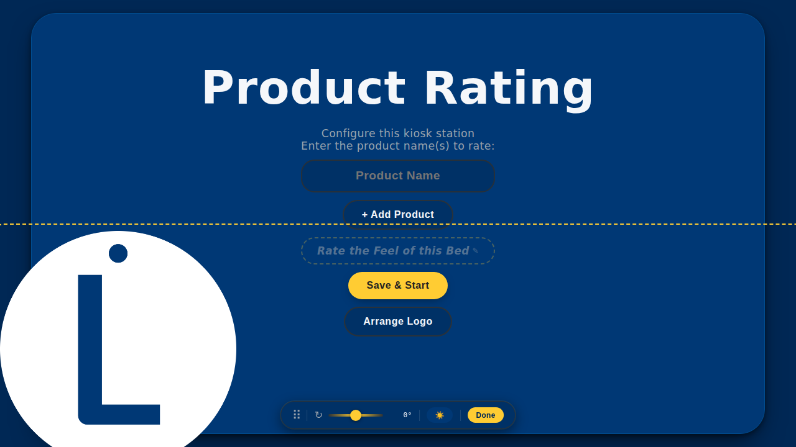

# UI Screenshots

Screenshots taken from the live app to document recent changes.

## 01 — Setup screen (label ghost collapsed)

The label prompt is shown as a subtle ghost pill with a dashed gold border and a small ✎ pencil icon. It wiggles gently every ~8–12 s to attract attention. Enter key in the product-name field adds a new row instead of submitting.

## 02 — Label ghost expanded to textarea (after tap)

Tapping the ghost promotes it to a full two-line editable textarea. Tapping anywhere else collapses it back to the ghost and saves the current value.

## 03 — Logo edit bar (opened from setup screen Arrange Logo button)

The "Arrange Logo" button is now available directly on the setup screen (no need to open Admin). The logo edit bar shows: drag grip ⠿, rotation slider ↻, the new logo-variant toggle 🌓, and Done.

## 04 — Logo variant: 🌑 dark forced

One tap cycles to 🌑 (force dark logo). The `.logo-force-dark` class hides `logo-light` and shows only `logo-dark`.

## 05 — Logo variant: ☀️ light forced

Second tap cycles to ☀️ (force light logo). Third tap returns to 🌓 auto (theme-responsive). The chosen variant is persisted in `kiosk:settings` as `logoVariant`.
